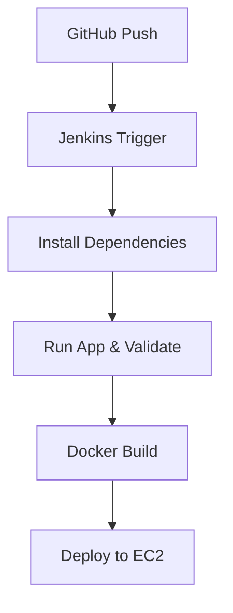

# 🏦 BankSecure

BankSecure is a secure banking backend built with Node.js, Docker, and Jenkins. It demonstrates CI/CD automation, containerized deployment, and real-time validation of service health — ideal for showcasing DevOps proficiency in cloud-native environments.

## 🚀 Tech Stack

- **Backend**: Node.js (Express)
- **CI/CD**: Jenkins
- **Containerization**: Docker
- **Cloud Deployment**: AWS EC2 (t3.large)

## 📦 Features

- RESTful API with secure endpoints
- Dockerized backend for consistent deployment
- Jenkins pipeline with multi-stage automation:
  - Dependency installation
  - App runtime validation
  - Docker image build
  - Deployment placeholder for EC2/Kubernetes

## 🔧 CI/CD Pipeline Overview

BankSecure/
├── src/
│   └── server.js
├── Dockerfile
├── Jenkinsfile
├── package.json
└── README.md
